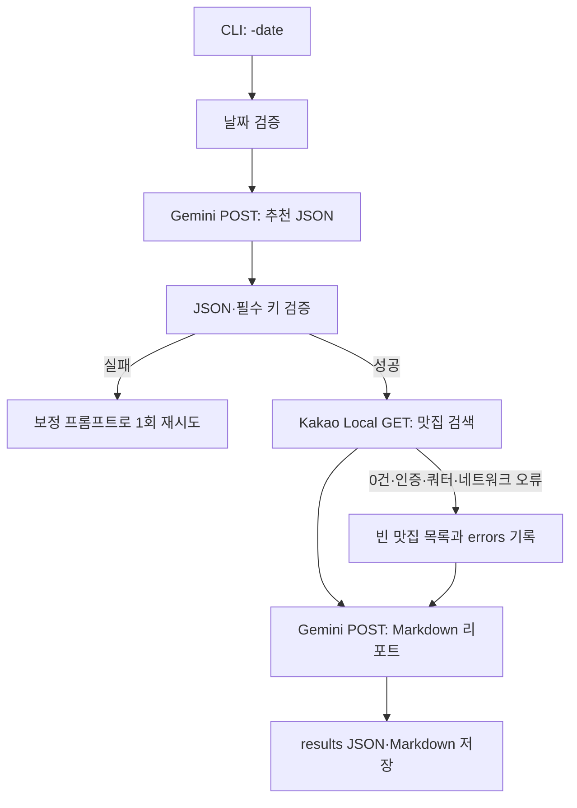

# AI 활용 학습 A1-2: Gemini 국내 여행 추천 CLI

**여행 날짜를 입력하면 Google Gemini API와 Kakao Local API를 순서대로 호출하여 국내 여행 추천 리포트를 만드는 Python CLI 프로그램**입니다. Gemini는 추천 지역·계절 날씨·행사 후보를 JSON으로 생성하고, 프로그램은 그 JSON의 `recommended_city`를 Kakao Local의 맛집 검색어로 연결합니다. 마지막으로 Gemini가 맛집 목록까지 포함한 Markdown 리포트를 만듭니다.

> 이 과제의 핵심은 정확한 실시간 예보가 아니라, **구조화된 AI 출력이 다음 외부 API의 입력으로 연결되는 흐름**을 안전하게 구현하는 것입니다.

| 구성 요소 | 선택한 제공자 | 역할 |
|---|---|---|
| LLM API | Google Gemini API | 추천 JSON과 최종 Markdown 리포트 생성 |
| 장소 검색 API | Kakao Local 키워드 검색 API | 추천 도시의 맛집 최대 5곳 검색 |
| CLI | Python `argparse` | 필수 날짜 입력 검증과 실행 제어 |
| 결과 파일 | JSON, Markdown | 원본 처리 데이터·오류 요약·최종 리포트 저장 |

## 설치와 실행

Python **3.10 이상**에서 프로젝트 폴더로 이동해 실행합니다.

```bash
python -m venv .venv
source .venv/bin/activate              # Windows PowerShell: .venv\Scripts\Activate.ps1
pip install -r requirements.txt
cp .env.example .env                   # Windows PowerShell: Copy-Item .env.example .env
```

`.env`에 본인의 Gemini와 Kakao 키를 입력합니다. Google AI Studio에서 발급한 Gemini API 키는 `GEMINI_API_KEY`로 설정합니다. Gemini API는 무료 등급에서 시작할 수 있지만, 사용 가능한 모델과 요청 제한은 계정·시점에 따라 달라질 수 있습니다.[1] 기본 모델은 `gemini-2.5-flash`이며, 계정에서 지원하지 않으면 AI Studio에서 사용 가능한 모델명으로 `GEMINI_MODEL`을 바꿉니다.

```dotenv
GEMINI_API_KEY=YOUR_GEMINI_API_KEY
KAKAO_REST_API_KEY=YOUR_KAKAO_REST_API_KEY
GEMINI_MODEL=gemini-2.5-flash
```

```bash
python travel_planner.py -date "2026-10-03"
# 또는
python travel_planner.py --date "2026-10-03"

# [보너스 과제] 기존 저장된 원본 데이터가 있다면 외부 API 호출 없이 캐시 재사용
python travel_planner.py -date "2026-10-03" --cached

# 기존 캐시를 무시하고 API를 새로 강제 호출
python travel_planner.py -date "2026-10-03" --refresh
```

```text
[1/3] 1차 추천 생성 중(Gemini)...
  - recommended_city: 강릉
[2/3] 맛집 검색 중(Kakao Local API)...
  - 맛집 5곳 검색 완료
[3/3] 최종 리포트 생성 중(Gemini)...
  - 리포트 생성 완료
완료! results/2026-10-03_travel_plan.md 및 results/2026-10-03_travel_data.json를 확인하세요.
```

`-date`는 필수이며, 실제 달력에 존재하지 않거나 `YYYY-MM-DD` 형식이 아니면 사용법과 오류를 출력하고 종료합니다. 동일한 날짜로 재실행 시 기존에 저장된 `results/{date}_travel_data.json`이 감지되면 자동으로 캐시를 활용하여 API 호출 비용을 절감합니다(`--refresh`로 새로고침 가능).

## API 키 발급과 결과 확인

Gemini API 키는 [Google AI Studio API Keys](https://aistudio.google.com/apikey)에서, Kakao REST API 키는 [Kakao Developers](https://developers.kakao.com/)에서 발급합니다. Gemini API는 API 키로 인증하고, Gemini의 구조화 출력은 JSON Schema를 통해 예측 가능한 JSON 응답을 만들 수 있습니다.[2] Kakao Local 키워드 검색은 `Authorization: KakaoAK {REST_API_KEY}` 헤더를 사용합니다.[3]

| 결과 파일 | 필수 포함 내용 | 용도 |
|---|---|---|
| `results/YYYY-MM-DD_travel_data.json` | `recommendation`, `restaurants`, `errors` | 추천 JSON·맛집 목록·오류 원인 확인 |
| `results/YYYY-MM-DD_travel_plan.md` | 지역·이유·날씨·행사·맛집·일정·오류 요약 | 사용자가 읽는 최종 여행 리포트 |

맛집 API가 실패하거나 결과가 없으면 프로그램은 중단하지 않습니다. 이때 `restaurants`는 빈 배열이 되고, 리포트의 맛집 섹션은 **데이터 없음**으로 표기됩니다.

## 요청 흐름과 오류 처리

Gemini 생성 요청은 JSON 본문을 보내는 `POST` 방식이고, Kakao Local 키워드 검색은 검색어를 쿼리 파라미터로 보내는 `GET` 방식입니다. Gemini의 1차 응답에는 JSON Schema를 적용하고, 프로그램은 `recommended_city`, `weather`, `events`, `reason`을 한 번 더 검증합니다.[2]



| 상황 | 프로그램 동작 |
|---|---|
| `GEMINI_API_KEY` 없음 | 즉시 종료하고 `.env` 설정 방법 출력 |
| Gemini 401/403 | 키 또는 Google AI Studio 프로젝트 설정을 점검하도록 안내 |
| Gemini 429 | 무료 등급 요청 제한·쿼터를 점검하도록 안내 |
| Gemini JSON 파싱 실패 | 보정 지시로 최대 1회 재요청 |
| Kakao 키 없음·401/403·429·네트워크 오류 | 맛집을 빈 목록으로 처리하고 리포트 생성은 계속 |
| 최종 Gemini 호출 실패 | 확보한 데이터로 대체 Markdown 리포트 생성 |

## 보안 주의 사항

**실제 API 키는 코드, README, 커밋 메시지, 로그, 결과 JSON·Markdown에 절대 작성하지 않습니다.** `.env`는 `.gitignore`에 포함되어 GitHub에 올라가지 않으며, `.env.example`에는 키 이름과 예시만 둡니다. `.env`를 만들고 Git에서 제외됐는지 확인하는 상세 절차는 [KAKAO_ENV_SETUP.md](KAKAO_ENV_SETUP.md)를 참고하세요.

키가 대화·공개 문서·GitHub 커밋에 노출되었다면 기존 키를 폐기하거나 교체하고 새 키로 `.env`만 갱신하세요.

## 참고 자료

[1] [Google AI, Gemini Developer API Pricing](https://ai.google.dev/gemini-api/docs/pricing)

[2] [Google AI, Gemini Structured Outputs](https://ai.google.dev/gemini-api/docs/structured-output)

[3] [Kakao Developers, Local API: Keyword Search](https://developers.kakao.com/docs/en/local/dev-guide)
