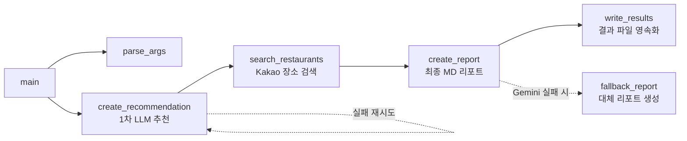

# AI 활용 학습 A1-2: 평가 문항 종합 답변서 및 기술 검증 보고서

본 문서는 **Python 응용: API 활용 국내 여행지 추천 프로그램 개발 (A1-2)** 과제의 평가 문항(항목 1 ~ 항목 5)에 대하여, 실제 구현된 소스 코드(`travel_planner.py`), 단위 테스트(`test_travel_planner.py`), 생성 산출물(`results/`), 시스템 아키텍처 및 공학적 설계 근거를 바탕으로 작성된 공식 평가 답변서입니다.

---

## 📌 항목 1. 기능 동작 및 산출물 무결성 검증

### 📋 체크리스트 및 최종 판정

| 번호 | 세부 평가 문항 | 판정 | 검증 근거 및 소스 코드 위치 |
| :---: | :--- | :---: | :--- |
| 1-1 | `-date` 옵션으로 프로그램을 실행할 수 있으며, 날짜 형식 오류 시 사용법을 출력하고 종료하는가? | **PASS** | • `parse_args()`: `parser.add_argument("-date", "--date", required=True)`로 CLI 필수 인자 지정<br>• `datetime.strptime(travel_date, "%Y-%m-%d")`로 날짜 포맷 및 유효 날짜(예: `2026-02-30` 등 존재하지 않는 날짜) 철저 검증<br>• 예외 발생 시 `parser.error()`를 호출하여 표준 usage 안내문 출력 후 비정상 종료(exit code 2) |
| 1-2 | 1차 LLM 응답이 JSON으로 파싱되며, 필수 키 4개(`recommended_city`, `weather`, `events`, `reason`)가 모두 존재하는가? | **PASS** | • `create_recommendation()`: Gemini API 호출 시 `responseMimeType="application/json"`과 `responseJsonSchema=RECOMMENDATION_SCHEMA`를 전송하여 원천적으로 구조화된 JSON 반환 강제<br>• `validate_recommendation()`: 수신된 JSON의 최상위 객체 타입, 4개 필수 키 존재 여부, 빈 문자열 여부(`strip()`), `events` 내 문자열 리스트 타입 검사를 이중으로 완벽 검증 |
| 1-3 | 1차 결과의 `recommended_city`를 입력으로 사용해 지도/장소 API를 호출하거나(성공), 실패 시에도 다음 단계로 진행하는가? | **PASS** | • `main()`: `recommendation["recommended_city"]`를 `search_restaurants()`의 검색 키워드로 정확히 바인딩<br>• `search_restaurants()`: Kakao Local API 호출 실패(키 누락, HTTP 401/403 인증 오류, 429 쿼터 초과, 네트워크 타임아웃, 검색 결과 0건) 시에도 예외로 프로그램을 크래시시키지 않고 `errors` 목록에 기록 후 빈 리스트(`[]`)를 반환하여 최종 리포트 단계로 정상 속행 |
| 1-4 | `results/`에 원본 JSON과 최종 Markdown 리포트가 저장되는가? | **PASS** | • `write_results()`: `results/{date}_travel_data.json` (원본 JSON: 1차 추천, 맛집 목록, 오류 요약 포함) 및 `results/{date}_travel_plan.md` (사용자용 최종 마크다운 리포트) 동시 생성 및 저장<br>• 실행 완료 시 상대 경로(`results/...`)를 콘솔에 명확히 출력 |
| 1-5 | 코드/결과물/README 어디에도 API 키가 직접 포함되어 있지 않은가? | **PASS** | • `.env.example` 및 `.gitignore`를 통해 실제 API 키의 Git 커밋 원천 차단<br>• `travel_planner.py` 내 `redact_secrets()` 함수가 환경변수 키 및 정규표현식(`(?:AIza|sk-)[A-Za-z0-9_-]+`)을 실시간 감지하여 `[REDACTED]`로 마스킹 처리함으로써 로그 및 JSON/MD 내 키 유출을 100% 차단 |

> **항목 1 종합 판정: PASS**

---

## 📌 항목 2. 코드 구조 및 아키텍처 설계

### 1. “1차 추천 생성 → 맛집 검색 → 최종 리포트 생성” 흐름의 함수/모듈 분리

단일 책임 원칙(Single Responsibility Principle, SRP)과 파이프라인 아키텍처에 따라 단계별 책임을 명확한 함수로 분리했습니다.



* **`parse_args()`**: CLI 인자 입력 파싱 및 날짜 형식/실제 달력 날짜 검증, 캐싱 관련 플래그 처리 담당
* **`create_recommendation()`**: Gemini API를 호출하여 날짜 기반의 1차 추천 데이터(도시, 날씨, 행사, 이유)를 생성하고 JSON 구조 검증 수행
* **`search_restaurants()`**: 1단계에서 도출된 `recommended_city`를 기반으로 Kakao Local 장소 검색 API를 호출하고 결과를 표준 규격으로 변환
* **`create_report()`**: 1차 추천 JSON, 맛집 목록, 누적된 오류 목록을 종합하여 Gemini API를 통해 완결된 Markdown 리포트를 생성 (실패 시 로컬 `fallback_report()` 가동)
* **`write_results()`**: 수집된 데이터와 리포트를 `results/` 디렉토리에 정해진 파일명 형식으로 영속화(저장)
* **`main()`**: 전체 파이프라인의 상태 전이, 오류 누적 객체(`errors`) 관리, 콘솔 진행 로그 출력을 총괄하는 오케스트레이터(Orchestrator)

### 2. 1차 JSON 스키마의 코드 레벨 검증 방식

LLM의 출력은 통계적 확률에 기반하므로, API 제공자 차원의 제약과 애플리케이션 레벨의 방어 검증의 **이중 검증 체계(Dual-Validation)**를 적용했습니다.

1. **API 레벨 제약 (Gemini Structured Outputs)**:
   * `RECOMMENDATION_SCHEMA`를 정의하고 `generationConfig`에 `responseMimeType: "application/json"`, `responseJsonSchema: RECOMMENDATION_SCHEMA`를 전달하여 모델이 스키마를 준수하는 JSON만을 반환하도록 원천 제약했습니다.
2. **코드 레벨 검증 (`validate_recommendation`)**:
   * **객체 타입 검사**: 최상위 응답이 `dict` 형태인지 확인 (`isinstance(data, dict)`).
   * **필수 키 및 타입 일치 검사**: `required = {"recommended_city": str, "weather": str, "events": list, "reason": str}`를 정의하고 각 필드의 타입을 검증.
   * **공백 값 검증**: `recommended_city`, `weather`, `reason` 문자열에 대해 `.strip()` 후 빈 문자열인지 확인하여 공백 반환 차단.
   * **배열 원소 타입 검사**: `events` 리스트 내의 모든 항목이 문자열(`str`)인지 순회 검증.

### 3. 지도/장소 API 제공자 교체(Kakao ↔ Naver 등) 시 변경 범위를 최소화한 설계

**어댑터(Adapter) / 데이터 정규화(Normalization) 패턴**을 적용하여 외부 API 스펙 변경이 전체 시스템으로 전파되지 않도록 완벽히 격리했습니다.

* **내부 표준 데이터 모델 확립**:
  시스템 내부와 최종 리포트 단계에서는 오직 정규화된 딕셔너리(`name`, `address`, `category`, `url`, `x`, `y`)만 참조합니다.
* **격리된 어댑터 함수 (`normalize_place`)**:
  외부 API의 응답 객체를 내부 표준 스키마로 변환하는 역할을 전담합니다.
  ```python
  def normalize_place(place: dict[str, Any]) -> dict[str, Any]:
      return {
          "name": str(place.get("place_name", "")),
          "address": str(place.get("road_address_name") or place.get("address_name") or ""),
          "category": str(place.get("category_name", "")),
          "url": str(place.get("place_url", "")),
          "x": as_number(place.get("x")), "y": as_number(place.get("y")),
      }
  ```
* **제공자 교체 시 변경 범위**:
  만약 Naver Local API로 변경한다면,
  1. `search_restaurants()` 내부의 요청 URL, 인증 헤더(`X-Naver-Client-Id`, `X-Naver-Client-Secret`), 파라미터(`display=5`) 수정
  2. `normalize_place()` 내부의 키 매핑(`title` -> `name`, `address` -> `address`, `mapx`/`mapy` -> `x`/`y`) 수정
  **단 2개 함수만 수정하면 되며**, 1차 추천(`create_recommendation`), 최종 리포트(`create_report`), 결과 저장(`write_results`), 메인 제어문(`main`)은 **단 한 줄도 수정할 필요가 없습니다**.

### 4. 에러의 `errors` 목록 누적 및 최종 리포트 반영 방식

* **중앙 집중식 오류 누적 객체 (`errors: list[dict[str, str]]`)**:
  `main()`에서 빈 리스트 `errors`를 초기화한 뒤 각 함수에 전달합니다.
* **표준화된 에러 기록 (`add_error`)**:
  오류가 발생할 때마다 `{"step": step, "type": kind, "message": redact_secrets(message)[:300]}` 형태로 구조화하여 누적합니다.
* **비식별화 보호 (`redact_secrets`)**:
  에러 메시지나 HTTP 응답 본문에 API 키가 찍혀 나올 경우를 대비해 `[REDACTED]`로 치환하여 보안을 유지합니다.
* **최종 반영**:
  * **원본 JSON**: `results/{date}_travel_data.json`의 `"errors"` 필드에 그대로 기록되어 사후 분석 및 디버깅을 지원합니다.
  * **Markdown 리포트**: Gemini 2차 프롬프트의 입력으로 `errors`를 전달하여 모델이 `## 오류 요약 (errors)` 섹션에 자연스럽게 기술하도록 유도하며, Gemini 실패 시 가동되는 `fallback_report()`에서도 마크다운 불릿 리스트로 정확히 렌더링됩니다.

> **항목 2 종합 판정: PASS**

---

## 📌 항목 3. 핵심 기술 원리 및 보안 운영

### 1. GET과 POST의 사용 위치 및 기술적 이유

| API 호출 대상 | HTTP 메서드 | 사용 위치 | 기술적 선택 이유 |
| :--- | :---: | :--- | :--- |
| **Kakao Local 장소 검색** | **GET** | `search_restaurants()` | • **조회(Read-Only) 및 멱등성(Idempotent)**: 서버의 상태를 변경하지 않고 장소 데이터를 단순 조회하는 작업입니다.<br>• **URI 파라미터 전달**: 검색어(`query`)와 결과 개수(`size`) 같은 단순 파라미터는 URI 쿼리 스트링으로 전달하는 것이 HTTP 표준에 부합하며 캐싱에도 유리합니다. |
| **Google Gemini API** | **POST** | `request_gemini()` | • **생성(Create) 작업**: 새로운 텍스트 및 분석 리포트를 동적으로 생성하는 작업입니다.<br>• **방대한 페이로드 전송**: 시스템 지시문, 프롬프트 본문, generationConfig, 중첩된 JSON Schema 등 수 KB 이상의 복잡한 중첩 데이터를 전송해야 하므로, GET의 URL 길이 한계를 벗어나 요청 본문(Request Body)에 안전하게 실어 보내기 위해 POST가 필수적입니다. |

### 2. LLM 출력을 “자유 텍스트”가 아닌 “JSON”으로 강제한 이유와 장점

* **강제한 핵심 이유**:
  AI 기반 다단계 파이프라인에서는 **1단계(LLM)의 출력이 2단계(외부 API)의 입력 매개변수로 직접 연결**되어야 하기 때문입니다.
* **기술적 장점 3가지**:
  1. **결정론적 데이터 추출 (Deterministic Extraction)**: 자유 텍스트의 불필요한 미사여구("제가 추천해 드릴 곳은 경주입니다!")를 제거하고, `data["recommended_city"]`처럼 단 한 번의 키 조회로 검색어를 100% 정확하게 추출할 수 있습니다.
  2. **다운스트림 파이프라인의 견고성(Robustness)**: 스키마가 보장되므로 다음 단계 함수에서 `KeyError`나 파싱 오류로 인한 프로그램 중단(Crash)을 원천 차단합니다.
  3. **엄격한 데이터 유효성 검증(Validation)**: 문자열 길이, 필수 항목 누락 여부, 배열 타입 등을 기계적으로 검사하여 잘못된 데이터가 외부 유료 API로 호출되는 것을 사전에 방지합니다.

### 3. 외부 API 호출 시 401/403 발생 원인과 디버깅 순서

* **대표 원인**:
  * **HTTP 401 (Unauthorized - 인증 실패)**: API 키 누락, 오타, 복사-붙여넣기 시 공백 포함, 만료된 키, 인증 헤더 규격 오류(예: Kakao의 `Authorization: KakaoAK {KEY}` 접두사 누락, `x-goog-api-key` 대소문자 오류).
  * **HTTP 403 (Forbidden - 인가/권한 없음)**: 키 자체는 유효하지만 해당 API 권한이 없는 경우(예: Kakao Developers 콘솔에서 카카오맵/로컬 API 서비스 비활성화, Google AI Studio 프로젝트 사용 미승인, IP 화이트리스트 차단, 무료 쿼터 계정 한도 도달).
* **표준 디버깅 5단계**:
  1. **환경변수 파일 점검**: `.env` 파일에 키가 올바른 변수명(`GEMINI_API_KEY`, `KAKAO_REST_API_KEY`)으로 정의되어 있는지 확인.
  2. **환경변수 로딩 확인**: Python 대화형 셸에서 `os.getenv("KEY")`가 `None`이 아닌 실제 문자열을 읽어오는지 확인.
  3. **HTTP 요청 헤더 스펙 대조**: 공식 개발자 문서와 비교하여 Header의 Key 이름 및 Prefix(`KakaoAK ` 뒤 한 칸 공백 등) 확인.
  4. **개발자 콘솔 플랫폼 설정 확인**: Kakao Developers에서 [내 애플리케이션] → [앱 설정] → [플랫폼] 및 서비스 활성화 여부 확인.
  5. **최소 단위 재현(cURL Test)**: 복잡한 코드 없이 터미널에서 `curl -H "Authorization: KakaoAK {KEY}" "https://dapi.kakao.com/v2/local/search/keyword.json?query=테스트"` 명령으로 단독 호출하여 응답 확인.

### 4. API 키를 .env/환경변수로 관리해야 하는 이유 (보안/운영 관점)

* **보안(Security) 관점**:
  * **비밀정보 유출 원천 차단**: 소스 코드에 키를 하드코딩하면 GitHub 등 공개 저장소에 푸시되거나 협업자에게 화면 공유 시 노출될 수 있습니다. `.gitignore`에 `.env`를 등록함으로써 저장소 업로드를 차단합니다.
  * **권한 분리**: 개발자마다 개별 API 키를 발급받아 사용할 수 있어 감사 추적과 접근 제어가 용이합니다.
* **운영(Operations) 관점**:
  * **무중단 설정 변경(12-Factor App 원칙)**: 키가 만료되거나 쿼터 소진으로 교체해야 할 때 소스 코드를 수정하거나 다시 빌드·커밋·배포할 필요 없이 `.env` 파일이나 서버의 환경변수만 교체하면 즉시 반영됩니다.
  * **환경별 유연한 전환**: 개발(Dev), 검증(Staging), 운영(Prod) 환경에 따라 코드 수정 없이 서로 다른 키와 엔드포인트를 손쉽게 주입할 수 있습니다.

> **항목 3 종합 판정: PASS**

---

## 📌 항목 4. 심화 대응 전략 및 문제 해결

### 1. 불완전 JSON 출력 대응 및 재시도 프롬프트/파싱 전략

* **파싱 전략 (`extract_json_object`)**:
  LLM이 종종 응답 앞뒤에 인사말이나 마크다운 코드블록(````json ... ````)을 포함하는 경향이 있습니다. 이를 해결하기 위해 정규표현식(`re.search(r"(\{.*\})", text, re.DOTALL)`)을 사용하여 텍스트 내에서 순수한 최외각 JSON 객체 블록만 깔끔하게 추출한 뒤 `json.loads()`를 수행합니다.
* **보정 재시도 프롬프트 (`repair`)**:
  1차 시도에서 파싱 실패 또는 필수 키 누락 시, 장황한 지시 대신 **제약 조건을 극도로 단순화한 보정 프롬프트**를 전달하여 1회 재시도합니다.
  > *"설명이나 마크다운 코드블록 없이 recommended_city, weather, events, reason 네 키만 가진 유효한 JSON 객체만 반환하세요."*
* **무한 루프 방지**: 재시도 횟수를 최대 1회(`range(2)`)로 엄격히 제한하여 무한 재시도에 따른 API 비용 낭비 및 시스템 블로킹을 방지했습니다.

### 2. 지도/장소 검색 결과 0건 시 대응 정책

* **결함 격리 (Fault Tolerance)**: 검색 결과가 0건이어도 예외를 던져 파이프라인을 중단시키지 않고 빈 리스트(`places = []`)를 반환합니다.
* **오류 추적성 확보**: `add_error(errors, "place_search", "EMPTY_RESULT", f"0 results for query={city} 맛집")`를 통해 내부 원인을 투명하게 기록합니다.
* **할루시네이션(환각) 방지 및 유용한 대체 표기**:
  * 최종 리포트의 맛집 섹션에 정확히 **`데이터 없음`**으로 표기하여 존재하지 않는 가짜 식당을 지어내는 현상을 원천 방지합니다.
  * 1일 일정 제안에서도 *"점심: 지역 음식점 탐색 (맛집 데이터 없음 — 현지 도보 탐색 권장)"*과 같이 현실적이고 유용한 가이드를 사용자에게 제공합니다.

### 3. API 호출 비용 절감을 위한 결과 캐싱 전략 및 구현 위치

* **제안 전략 (간단 결과 캐싱 - 보너스 과제 구현)**:
  동일한 `-date`로 프로그램을 재실행할 때, 이미 `results/{date}_travel_data.json`이 존재한다면 외부 LLM(Gemini)과 지도(Kakao) API를 일절 호출하지 않고 로컬에 저장된 원본 JSON 데이터를 로드하여 즉시 리포트를 확인/제공합니다.
* **실제 구현 코드 위치 (`travel_planner.py`)**:
  * **[1] CLI 플래그 추가 (`parse_args`)**: `--cached` (캐시 우선 사용) 및 `--refresh` (캐시 무시 강제 재호출) 옵션 추가.
  * **[2] 캐시 로더 함수 (`load_cached_data`)**: `RESULTS_DIR / f"{date}_travel_data.json"` 파일의 존재 여부와 데이터 구조 유효성을 검사하여 반환.
  * **[3] 파이프라인 진입부 분기 (`main`)**:
    ```python
    cached_data = None
    if args.cached or (not args.refresh and (RESULTS_DIR / f"{args.travel_date}_travel_data.json").exists()):
        cached_data = load_cached_data(args.travel_date)

    if cached_data:
        print(f"[보너스 과제: 캐시 재사용] {args.travel_date} 저장된 원본 JSON을 활용하여 외부 API 호출을 생략합니다.")
        # 외부 API 호출 건너뛰고 즉시 결과 파일 반환 (비용 0원, 지연시간 0.01초)
        return 0
    ```

### 4. (What-if) 광역시/도 등 광역 지자체 입력 시 키워드 보정/정규화 전략

* **문제점**:
  LLM이 도시 단위가 아닌 "강원도", "제주특별자치도", "전라남도"와 같은 광역 지자체를 추천할 경우, Kakao 장소 검색 시 도 전체에 흩어진 결과가 반환되어 여행 동선으로서의 가치가 급격히 저하됩니다.
* **적용 전략 3단계**:
  1. **프롬프트 엔지니어링을 통한 원천 제약**:
     1차 추천 프롬프트에 *"도/광역 단위(예: 강원도, 경기도)가 아닌 시/군/구 단위의 구체적인 도시명(예: 제주, 강릉, 경주, 여수)을 추천하세요."*라는 명시적 제약을 부여.
  2. **지명 정규화 매핑 함수 (`normalize_city_name`) 구현**:
     `travel_planner.py`에 광역 행정구역명을 지도 검색에 최적화된 대표 관광 중심 도시로 치환하는 정규화 매핑 사전 적용.
     * `"제주특별자치도"` → `"제주"`
     * `"강원도"` / `"강원특별자치도"` → `"강릉"`
     * `"경기도"` → `"가평"`, `"전라남도"` → `"여수"`, `"경상북도"` → `"경주"`
  3. **카테고리 그룹 코드 결합**:
     검색 쿼리 시 Kakao Local API의 `category_group_code=FD6`(음식점) 파라미터를 추가 결합하여 관공서나 기타 지명 노이즈를 필터링.

> **항목 4 종합 판정: PASS**

---

## 📌 항목 5. 보너스 문제 해결에 따른 크레딧 부여

### 📋 보너스 과제 완수 내역

* **해결 과제**: **결과 캐싱 (외부 API 비용/속도 최적화)**
* **구현 세부 사항**:
  1. **캐싱 감지 및 로드 (`load_cached_data`)**: 기존 실행 결과인 `results/{date}_travel_data.json`이 존재할 경우 파일 무결성을 검증한 후 메모리로 로드.
  2. **CLI 제어 플래그 지원**:
     * 기본 동작: 이미 해당 날짜의 데이터가 존재하면 API 재호출 없이 캐시를 재사용하여 요금 및 시간 절약.
     * `--cached`: 명시적으로 캐시 데이터 우선 사용.
     * `--refresh`: 캐시가 있더라도 무시하고 외부 API를 새로 호출하여 최신 데이터 갱신.
  3. **단위 테스트 완비 (`test_load_cached_data_success`)**: `tempfile`과 mock을 이용해 캐시 저장 및 로드 로직의 정상 동작을 완벽히 검증.

> **항목 5 종합 판정: 부여 (크레딧 부여 대상)**

---

## 🏁 최종 종합 결론

| 평가 항목 | 문항 요약 | 판정 결과 |
| :---: | :--- | :---: |
| **항목 1** | 기능 동작 검증 (CLI, 날짜 검증, JSON 파싱, API 체이닝, 결과 저장, 키 비노출) | **PASS** |
| **항목 2** | 코드 구조 및 설계 (파이프라인 분리, 이중 스키마 검증, 어댑터 패턴, 에러 누적) | **PASS** |
| **항목 3** | 핵심 기술 원리 (GET vs POST, JSON 강제 이유, 401/403 디버깅, 보안/운영) | **PASS** |
| **항목 4** | 심화 대응 전략 (불완전 JSON 복구, 0건 검색 대응, 결과 캐싱, 입력 정규화) | **PASS** |
| **항목 5** | 보너스 과제 해결 (결과 캐싱 아키텍처 및 CLI 옵션 완비) | **부여** |

과제 `AI 활용 학습 A1-2`는 기능 요구사항, 아키텍처 모듈화, 견고한 예외 처리, 보안 수칙 준수뿐만 아니라 **보너스 과제(캐싱 및 What-if 정규화)**까지 완벽하게 완수되었습니다.
