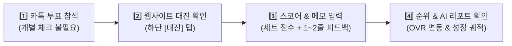
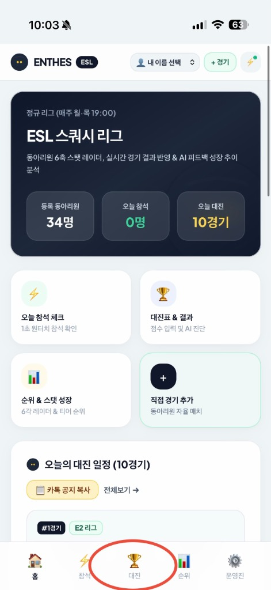
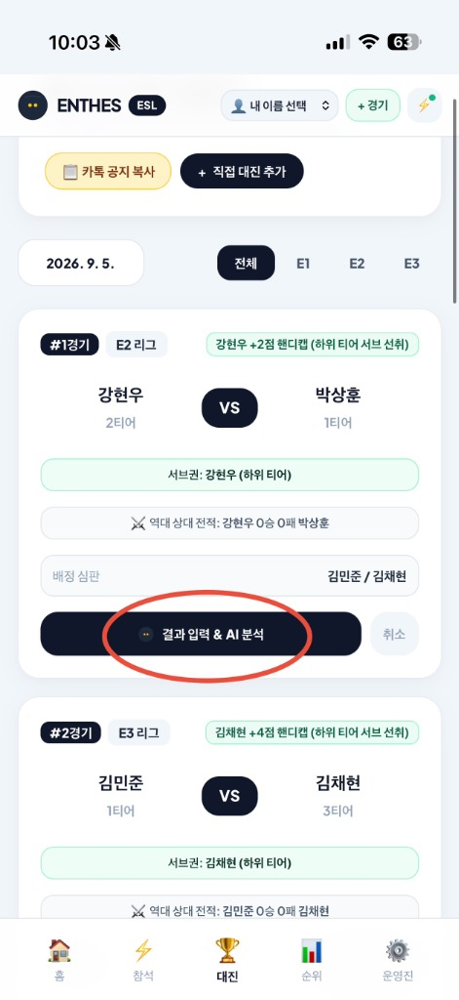
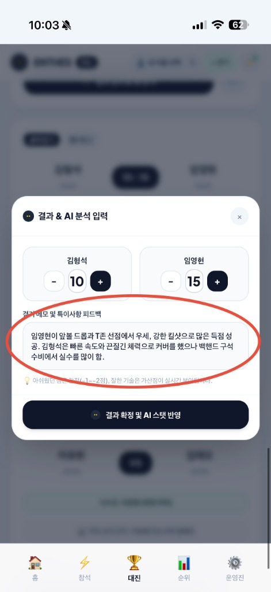
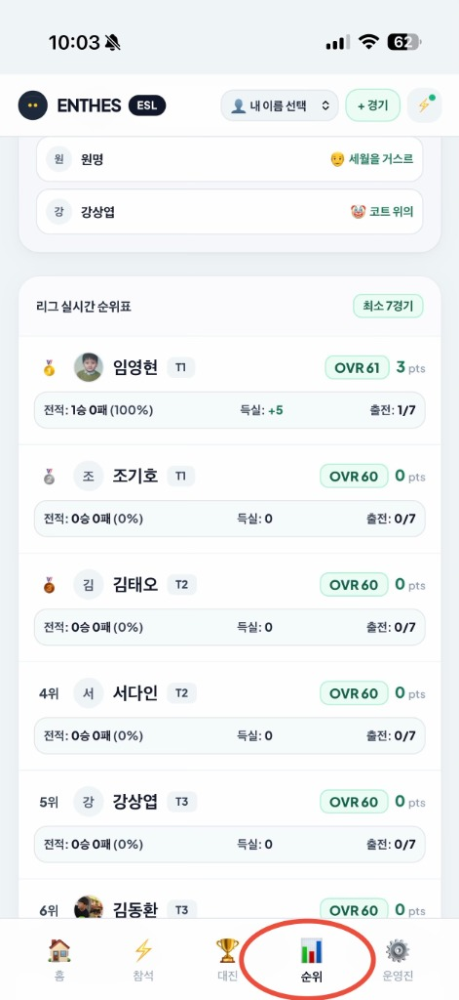
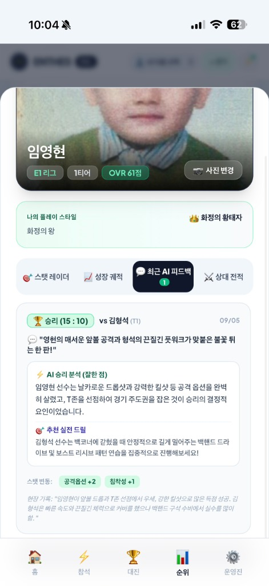
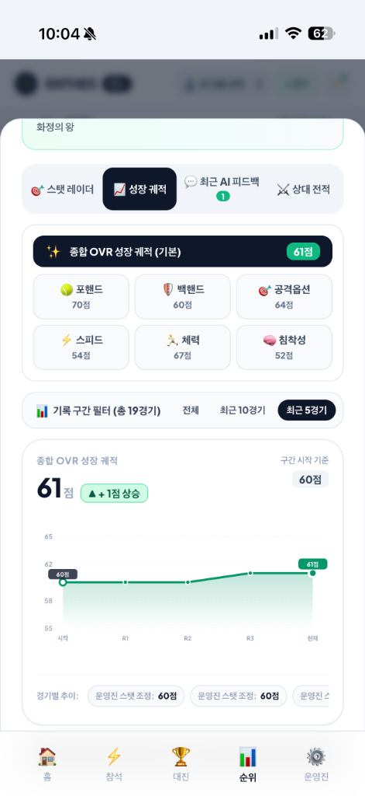
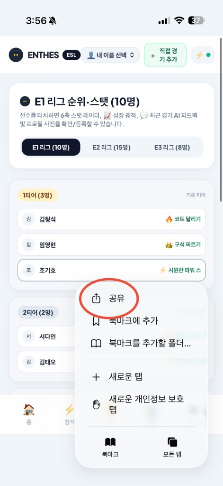
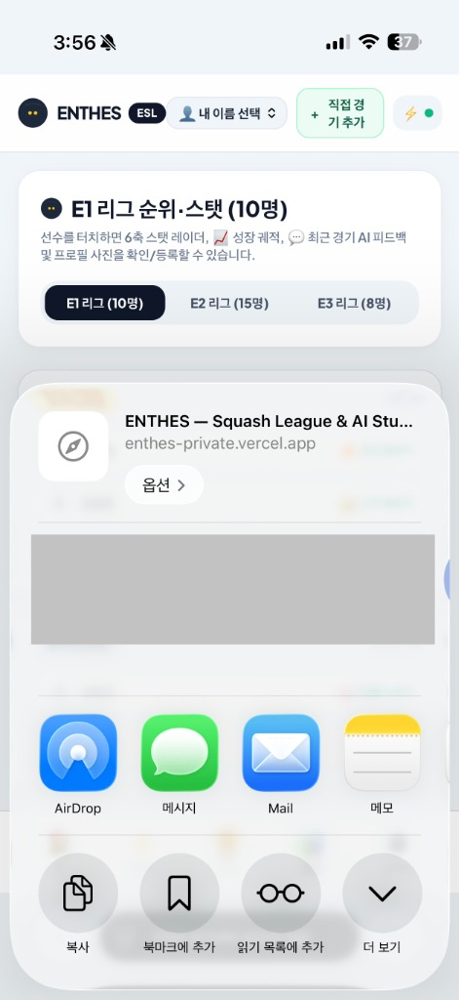
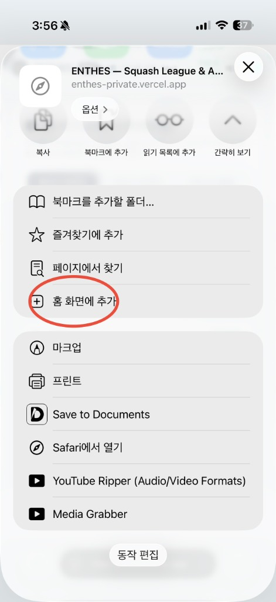

# 📱 ESL 홈페이지 이용 안내서

> 본 안내서는 새롭게 개편된 **ENTHES ESL 리그 웹사이트의 기본 이용 절차**와 **경기 결과·피드백 입력 방법**, **홈 화면 바로가기 앱 추가 방법**을 안내합니다.

---

## 📌 목차
1. [웹사이트 기본 이용 절차 요약](#1-웹사이트-기본-이용-절차-요약)
2. [[가이드 1] 경기 결과 및 피드백 입력 방법 (1~3단계)](#2-가이드-1-경기-결과-및-피드백-입력-방법-13단계)
3. [[가이드 2] 실시간 순위 및 AI 피드백 · 성장 궤적 확인 (4~6단계)](#3-가이드-2-실시간-순위-및-ai-피드백--성장-궤적-확인-46단계)
4. [[가이드 3] 아이폰 홈 화면에 '앱'으로 추가하기 (Safari PWA 3단계)](#4-가이드-3-아이폰-홈-화면에-앱으로-추가하기-safari-pwa-3단계)
5. [부원 이용 FAQ](#5-부원-이용-faq)

---

## 1. 웹사이트 기본 이용 절차 요약

1. **카톡 투표 참석**: 웹사이트에서 별도 출석 체크를 누르실 필요 없이 기존 동아리 단톡방 투표로 참석 여부를 제출해주세요.
2. **웹사이트 대진 확인**: 사이트 접속 후 하단 **[대진]** 탭에서 당일 경기 일정을 확인해주세요.
3. **경기 결과 입력**: 경기 종료 후 해당 카드에서 세트 점수와 경기 메모(피드백)를 입력해주세요.
4. **순위 및 AI 피드백 확인**: 하단 **[순위]** 탭에서 실시간 순위 변동, 6대 스탯 상세 점수, AI 코칭 리포트를 확인해주세요.

---

## 2. [가이드 1] 경기 결과 및 피드백 입력 방법 (1~3단계)

경기가 끝난 후 경기 카드를 통해 결과를 등록해주세요.

| **1단계: 대진 탭 이동** | **2단계: 결과 입력 터치** | **3단계: 점수 및 메모 입력 (핵심)** |
| :---: | :---: | :---: |
|  |  |  |
| **하단 네비게이션의 [대진] 탭 터치** | **내 경기 카드의 [결과 입력 & AI 분석] 터치** | **세트 점수 입력 및 특이사항 메모 작성** |

### 📝 경기 메모(피드백) 작성 안내
- **작성 요령**: 길게 쓰실 필요 없이, **주요 득점 기술이나 보완점**을 단어 또는 1~2줄로 간단히 작성해주세요.
- **단일 메모 작성 규칙**: 하나의 메모란에 두 선수의 경기 내용을 함께 작성해주시면, AI가 각 선수의 플레이를 식별하여 개별 스탯 증감 및 맞춤 코칭 팁을 자동으로 산출합니다.
- **결과 확정**: '결과 확정 및 AI 스탯 반영' 버튼을 누르면 AI 코칭 스튜디오가 데이터를 즉시 산출하여 순위표와 프로필에 반영합니다.

> 📌 **경기 메모는 필수가 아닌 선택 사항입니다.**  
> 점수만 입력하셔도 정상 저장됩니다. 다만 메모를 남겨주시면 AI가 선수의 6대 스탯과 경기력을 정밀하게 분석하여 승급 및 코칭에 실시간 반영하므로, **가급적 한두 줄이라도 간단히 작성해주시면 감사하겠습니다.**

---

## 3. [가이드 2] 실시간 순위 및 AI 피드백 · 성장 궤적 확인 (4~6단계)

결과가 저장되면 순위표와 개인별 프로필에 실시간으로 반영됩니다.

| **4단계: 실시간 랭킹 반영** | **5단계: 최근 AI 피드백 열람** | **6단계: 6대 스탯 및 성장 궤적** |
| :---: | :---: | :---: |
|  |  |  |
| **하단 [순위] 탭에서 승패 및 OVR 변동 확인** | **선수 터치 시 AI 승리 분석 및 맞춤 드릴 확인** | **포핸드·백핸드 세부 점수 및 경기별 추이 확인** |

### 📊 [실전 입력 예시] 김형석 vs 임영현 (10 : 15) 결과
- **입력 메모**: *"임영현이 앞볼 드롭과 T존 선점에서 우세, 강한 킬샷으로 많은 득점 성공. 김형석은 빠른 속도와 끈질긴 체력으로 커버를 했으나 백핸드 구석 수비에서 실수를 많이 함."*
- **AI 승리 분석**: *"임영현 선수는 날카로운 드롭샷과 강력한 킬샷 등 공격 옵션을 효과적으로 구사하였으며, T존을 선점하여 경기 주도권을 확보함."*
- **AI 추천 드릴**: *"김형석 선수는 백코너 수세 시 안정적인 백핸드 드라이브 렝스 확보 및 보스트 리시브 패턴 훈련을 권장함."*
- **스탯 산출 결과**: 임영현 **공격옵션 +2, 침착성 +1** ➔ 종합 OVR 60점에서 **61점으로 승급**

---

## 4. [가이드 3] 아이폰 홈 화면에 '앱'으로 추가하기 (Safari PWA 3단계)

웹 브라우저 주소창 없이 바탕화면 아이콘으로 바로 접속할 수 있습니다.

| **1단계: 공유 메뉴 열기** | **2단계: 공유 시트 스크롤** | **3단계: 홈 화면에 추가** |
| :---: | :---: | :---: |
|  |  |  |
| **Safari 하단 툴바 메뉴의 [공유] 터치** | **공유 옵션 창 메뉴 목록을 아래로 스크롤** | **[+ 홈 화면에 추가] 터치 후 우측 상단 [추가]** |

### 📱 홈 화면 앱 추가 시 특장점
1. **원터치 즉시 실행**: 카카오톡 링크를 찾을 필요 없이 바탕화면 아이콘으로 1초 만에 실행
2. **전체 화면 모드**: Safari 상하단 주소창과 메뉴바가 제거되어 전용 앱과 동일하게 넓은 화면 제공
3. **자동 로그인 유지**: 설정한 내 이름과 프로필 상태가 지속 유지됨

---

## 5. 부원 이용 FAQ

### Q. 경기 메모(피드백)는 꼭 작성해야 하나요?
> **A.** 필수가 아닌 선택 사항입니다. 점수만 입력하셔도 정상 저장되지만, 1~2줄이라도 간단히 적어주시면 AI가 스탯 변동과 맞춤 코칭 팁을 자동으로 분석해드립니다.

### Q. 경기 메모는 선수마다 따로 작성해야 하나요?
> **A.** 아닙니다. 하나의 메모 입력란에 두 선수의 경기 내용이나 랠리 양상을 함께 적어주시면, AI 엔진이 각 선수의 이름을 식별하여 개별 스탯 증감 및 맞춤 코칭 팁을 자동으로 분리 산출합니다.

### Q. 실수로 점수를 잘못 입력하면 어떻게 하나요?
> **A.** 운영진에게 수정을 요청해주세요. 경기 기록 삭제 또는 수정 시 해당 경기로 변경되었던 선수 스탯은 기록 직전 상태로 100% 자동 원상복구됩니다.
